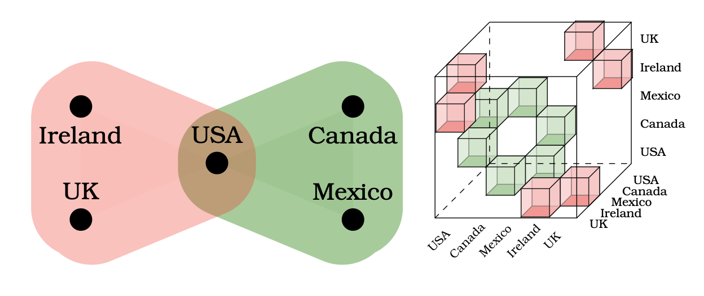

# Announcing Hypergraph Adjacency Tensor Preview

To announce an exploration of hypergraphs using tensors, available in our github [repo](https://github.com/thetensor-space/Hypergraphs). 

---

A reference page for the Hypergraph Toolkit: a small library for studying the adjacency tensors of hypergraphs. This code is written in [Magma](https://magma.maths.usyd.edu.au/magma/). More work needs to be done to implement this in python or other commonly used languages.




## Notation
A hyperedge $e$ is a set of vertices from some vertex set $V$. A hypergraph is then a collection $\mathcal{H}$ of hyperedges. From here on $\mathcal{H}$ will be used to denote the hypergraph. $\mathcal{H}$ is *d-uniform* if all of its hyperedges have exactly d elements/vertices. 

To define the *adjacency tensor* of a d-uniform hypergraph $\mathcal{H}$ on $n$ vertices, we first formalize the bijection between a set of $n$ vertices and $K^n$, for some ring $K$.

$$\varphi: V \rightarrow K^n$$
$$\varphi(v_i) := e_i$$

The *adjacency tensor* of a d-uniform hypergraph $\mathcal{H}$ on $n$ vertices is then defined on a basis
$$\Gamma:  \overbrace{K^n \times \cdots \times K^n}^{d} \rightarrow \{0,1\}, $$
$$ \Gamma(e_{i_1},e_{i_2},\dots,e_{i_d}) := \begin{cases}
    1 & \{\varphi^{-1}(e_{i_1}),\varphi^{-1}(e_{i_2}),\dots,\varphi^{-1}(e_{i_d})\} \in \mathcal{H}
    \\
    0 & else
\end{cases}.$$
More informally, 

$$\Gamma: V^d \rightarrow \{0,1\}, $$
$$ \Gamma(x_1,x_2,\dots,x_d) := \begin{cases}
    1 & \{x_1, x_2, \dots, x_d\} \in \mathcal{H}
    \\
    0 & else
\end{cases}.$$

We will continue to use this informal definition, but note that we are implicitly treating each vertex $i$ as the corresponding standard basis vector $e_i$ via the bijection $\varphi$.

## How to Express a Hypergraph

In this package, all hyperedges are enumerated sets. So for the following hypergraph


the hyperedges are $\{1,2,3\}$, $\{3,4,5\}$, $\{5,6,7\}$, and $\{3,5,8\}$. To store a hypergraph, the optimal organization is to collect hyperedges by cardinality, i.e. $\{1,2\}$ is collected with $\{3,4\}$, but not together with $\{1,2,3\}$.  Each collection of hyperedges of the same cardinality is collected in a list, so $[\{1,2\},\{3,4\}]$, and $[\{1,2,3\},\{4,5,6\}]$. In the previous hypergraph, the hyperedges are all collected in a list $[ \{1,2,3\}, \{3,4,5\}, \{5,6,7\},\{3,5,8\}]$.

Once hyperedges of the same cardinality are collected, the hypergraph is an ordered list of these collections of hyperedges. The ordering is according to the cardinality of the hyperedges. So the following hypergraph 


 is read as $[[\{1\},\{3\},\{4\}], [\{1,2\},\{1,3\},\{3,4\}],[\{1,2,3\},\{2,3,4\},\{3,4,5\}]]$

For ease of compatibility, there is a function "OrganizeHypergraph" which takes in an enumerated set of hyperedges, i.e. {{1,2,3},{1,2},{1,2,3,5}}, and outputs hypergraphs in the expected format. This would allow us to initially store the previous hypergraph as
$$\{ \{1,3\}, \{2,3,4\},\{1\}, \{3,4,5\},\{3,4\},\{1,2\}, \{1,2,3\}, \{3\}, \{4\}\}$$
prior to calculations. At this time, there is no function to convert non-uniform hypergraphs into uniform hypergraphs. Such transformations are expected to occur prior to using this tool. However, if your hypergraph has hyperedges of various cardinalities, you can specify which maximal d-uniform sub-hypergraph you want to study. 


You must also specify your base field $K$ for calculations. We are typically using the rationals $Rationals()$, but finite fields  $GF(p)$ can also be used.

## Finding Features

The following is an example of how the program identifies features


```magma
unorganized_hypergraph:={{1,2,3},{3,4,5},{5,6,7},{7,8,9},{9,10,11},{11,12,13},{13,14,15}, {5,17,18},{5,16,18},{5,16,17},{16,17,18},{10,19,20},{10,19,21},{10,20,21},{19,20,21},{6,21,22},{17,20,22},{15,23,24},{24,25,26},{27,28,29},{1,29,30}};
organized_hypergraph:=OrganizeHypergraph(unorganized_hypergraph);
d:=3; //Specify d-uniform hypergraph
K:=Rationals();
preserved_edges, discarded_edges, translations, hyperedge_history:= HyperDecomposition(organized_hypergraph,d,K);
discarded_edges; //shows which hyperedges were discarded at each step of the recursion
preserved_edges;//shows which hyperedges were not discarded at each step
translations;//throughout the algorithm, vertices are relabeled
hyperedge_history;//Show where translations occur


```

## Additional Features

$HGScrambler$ applies a random permutation of vertex labeling
```magma
original_hypergraph:= [ [{ 3 }, { 1 }, { 4 }],
    [{ 1, 3 }, { 1, 2 }, { 3, 4 }],
    [{ 1, 2, 3 }, { 2, 3, 4 }, { 3, 4, 5 }] ];

permuted_hypergraph:=HGScrambler(original_hypergraph);

permuted_hypergraph;
[ [{ 1 }, { 2 }, { 5 }],
[{ 1, 2 }, { 2, 3 }, { 1, 5 }],
[{ 1, 2, 3 }, { 1, 3, 5 }, { 1, 4, 5 }] ]
```

The functions in Hypergraph creation give some automatic ways of generating hypergraphs

```magma
mountainrange:=MountainRangeMaker(4);
mountainrange;
[ [], [],
[{ 1, 2, 3 }, { 3, 4, 5 }, { 5, 6, 7}, {7, 8, 9}] ]
mountainrange:=MountainRangeMaker(3: dim:=4);//dim determines the cardinality of the mountains. 
mountainrange;
[[],[],[],
[ { 1, 2, 3, 4 }, { 4, 5, 6, 7}, { 7, 8, 9, 10}] ]
```


The functions in Tests give various tests that can be done to the associated algebras, i.e. the derivation algebra. 


